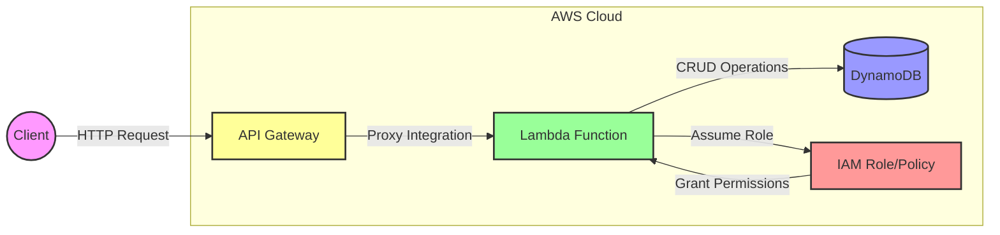

# 🦀 Rusty Serverless API

A robust serverless REST API built with Rust, AWS Lambda, and DynamoDB.

## 📊 Architecture Diagram



This diagram shows:

1. Client making HTTP requests to API Gateway endpoints (from `main.tf` API Gateway configuration)
2. API Gateway proxying requests to Lambda Function (defined in `aws_api_gateway_integration` resources)
3. Lambda Function assuming IAM role (from `aws_iam_role` configuration)
4. IAM role/policy granting permissions (from `aws_iam_policy` configuration)
5. Lambda Function performing CRUD operations on DynamoDB (from the Rust handlers in `src/`)

## 🌟 Features

- **Serverless Architecture**: Built on AWS Lambda and API Gateway
- **Rust Performance**: Blazing fast execution with minimal cold starts
- **DynamoDB Integration**: Scalable NoSQL database backend
- **Complete CRUD Operations**: Full REST API implementation
- **Infrastructure as Code**: Fully automated deployment with Terraform
- **Development Tools**: Ansible playbooks for development environment setup

## 🚀 Quick Start

### Prerequisites

- Rust (1.82.0 or later)
- Docker
- AWS CLI configured
- Terraform (1.9.8 or later)

### Environment Setup

Create a `.env` file with your AWS credentials:

```bash
AWS_ACCESS_KEY_ID=your_access_key
AWS_SECRET_ACCESS_KEY=your_secret_key
AWS_REGION=your_region
AWS_LAMBDA_ROLE_NAME=RustyLambdaRole
AWS_DYNAMODB_TABLE_NAME=RustyServerlessAPI
AWS_API_NAME=RustyServerlessAPI
```

### Build and Deploy

1. Build the Lambda function:

```bash
./scripts/deploy.sh
```

2. Or use individual Terraform commands:

```bash
./scripts/terraform.sh init
./scripts/terraform.sh apply
```

## 🛠 API Endpoints

| Method | Endpoint | Description          |
| ------ | -------- | -------------------- |
| POST   | /items   | Create new item      |
| GET    | /items   | Read item by ID      |
| PUT    | /items   | Update existing item |
| DELETE | /items   | Delete item by ID    |

### Request Examples

```bash
# Create Item
curl -X POST ${API_URL}/items \
  -H "Content-Type: application/json" \
  -d '{"id": "123", "data": "example"}'

# Read Item
curl -X GET ${API_URL}/items \
  -H "Content-Type: application/json" \
  -d '{"id": "123"}'

# Update Item
curl -X PUT ${API_URL}/items \
  -H "Content-Type: application/json" \
  -d '{"id": "123", "data": "updated"}'

# Delete Item
curl -X DELETE ${API_URL}/items \
  -H "Content-Type: application/json" \
  -d '{"id": "123"}'
```

## 🏗 Project Structure

```
.
├── src/                    # Rust source code
│   ├── main.rs            # Lambda handler
│   ├── lib.rs             # Core library
│   ├── create.rs          # Create operation
│   ├── read.rs            # Read operation
│   ├── update.rs          # Update operation
│   └── delete.rs          # Delete operation
├── terraform/             # Infrastructure as Code
├── ansible/               # Development environment setup
└── scripts/              # Deployment and utility scripts
```

## 🔧 Development

Set up the development environment using Ansible:

```bash
cd ansible
ansible-playbook -i inventory.ini dev.yml
```

## 🤝 Contributing

Contributions are welcome! Please feel free to submit a Pull Request.

1. Fork the repository
2. Create your feature branch (`git checkout -b feature/AmazingFeature`)
3. Commit your changes (`git commit -m 'Add some AmazingFeature'`)
4. Push to the branch (`git push origin feature/AmazingFeature`)
5. Open a Pull Request

## 📝 License

This project is licensed under the MIT License - see the LICENSE file for details.
